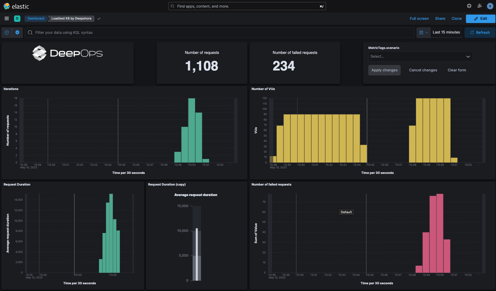

# k6-testkit-resources
A condensed demo setup of everything you need to get k6 running seriously on k8s

# what you will need

- github account
- [PAT with repo:read scope](https://github.com/settings/tokens/new?scopes=read:packages)
- a running kubernetes system and the usual suspects of tools. our recommendation: [rancher-desktop](https://docs.rancherdesktop.io/getting-started/installation/)
- [k6 installed](https://k6.io/docs/get-started/installation/)
- [k6-operator installed](https://github.com/grafana/k6-operator)
- minimal javascript knowledge
- minimal knowledge about handling dashboard and visualizations in kibana

# prepare environment

- install elasticsearch via 
  - `kubectl create -f https://download.elastic.co/downloads/eck/2.6.1/crds.yaml` and
  - `kubectl apply -f https://download.elastic.co/downloads/eck/2.6.1/operator.yaml` 
- create a namespace `kubectl create ns k6demo`
- switch context `kubectl config set-context --current --namespace k6demo`
- issue a [token with scope repo:read] (https://github.com/settings/tokens/new?scopes=read:packages)
- export the token in your shell `export CR_PAT=YOUR_TOKEN`
- create a secret to allow k8s to pull from our repository by 
```
kubectl create secret docker-registry github-registry \
--docker-server=https://ghcr.io \
--docker-username=unset \
--docker-password=$CR_PAT \
--docker-email=support@nextevolution.de \
-n k6demo
```
- `kubectl apply -f resources/k6_elasticsearch.yaml`
- `kubectl apply -f resources/k6_kibana.yaml`
- check with `watch kubectl get k6 k6-test-by-deepshore` for completion
- port forward `kubectl port-forward service/metrics-ui-kb-http 5601`
- open [kibana in browser](https://localhost:5601) and login with `elastic` and the password you obtain with this command `kubectl get secret metrics-db-es-elastic-user -o=jsonpath='{.data.elastic}' | base64 --decode; echo`
- import the saved objects located in [kibana folder](kibana/export.ndjson) via [Kibana Stack Management](https://localhost:5601/app/management/kibana/objects)
- Check [Kibana Dashboards](https://localhost:5601/app/dashboards)
- done. you have a complete k8s based k6 testing environment.

# run tests

- `kubectl apply -f resources`
- `kubectl wait --for=jsonpath='{.status.stage}'=finished k6 k6-test-by-deepshore`
- now check [that dashboard](https://localhost:5601/app/dashboards) again

## preview



